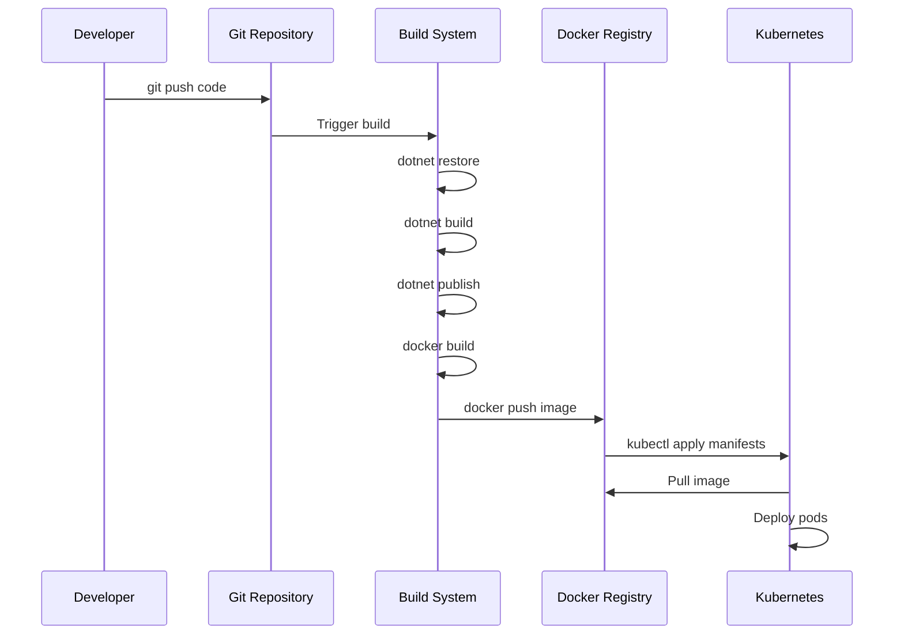
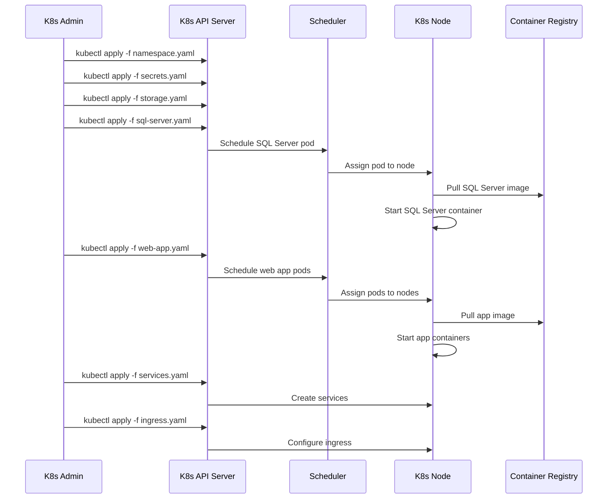

# Property Management System - System Flow Diagram

## Complete Architecture & Data Flow Visualization

```mermaid
graph TB
    %% User Interface Layer
    subgraph "?? Presentation Layer (ASP.NET Core Razor Pages)"
        Browser[?? User Browser]
        Login[?? Login Page]
        Dashboard[?? Dashboard]
        TenantPages[?? Tenant Management]
        RoomPages[?? Room Management]
        PaymentPages[?? Payment Management]
        MaintenancePages[?? Maintenance]
        InspectionPages[?? Inspections]
        LeasePages[?? Lease Agreements]
        UtilityPages[? Utility Bills]
    end

    %% Authentication & Authorization
    subgraph "?? Authentication & Authorization"
        Auth[Cookie Authentication]
        AuthZ[Role-based Authorization]
        Claims[Claims Principal]
    end

    %% Controllers Layer
    subgraph "?? Controllers Layer"
        BaseCtrl[??? BaseController]
        HomeCtrl[?? HomeController]
        TenantsCtrl[?? TenantsController]
        RoomsCtrl[?? RoomsController]
        PaymentsCtrl[?? PaymentsController]
        MaintenanceCtrl[?? MaintenanceController]
        InspectionsCtrl[?? InspectionsController]
        LeaseCtrl[?? LeaseAgreementsController]
        UtilityCtrl[? UtilityBillsController]
    end

    %% ViewModels
    subgraph "?? ViewModels"
        TenantVM[TenantViewModel]
        RoomVM[RoomViewModel]
        PaymentVM[PaymentViewModel]
        MaintenanceVM[MaintenanceRequestViewModel]
        InspectionVM[InspectionViewModel]
        LeaseVM[LeaseAgreementViewModel]
        UtilityVM[UtilityBillViewModel]
    end

    %% Validation Layer
    subgraph "? Validation Layer"
        FluentValidation[FluentValidation Rules]
        ClientValidation[Client-side Validation]
        ServerValidation[Server-side Validation]
    end

    %% AutoMapper
    AutoMapper[?? AutoMapper<br/>Object Mapping]

    %% Application Services Layer
    subgraph "??? Application Services Layer"
        TenantService[ITenantApplicationService]
        PaymentService[IPaymentApplicationService]
        LeaseService[ILeaseAgreementApplicationService]
        RoomService[IRoomApplicationService]
        InspectionService[IInspectionApplicationService]
        MaintenanceService[IMaintenanceApplicationService]
    end

    %% DTOs
    subgraph "?? Data Transfer Objects (DTOs)"
        TenantDto[TenantDto]
        PaymentDto[PaymentDto]
        LeaseDto[LeaseAgreementDto]
        RoomDto[RoomDto]
        CreateDtos[CreateXxxDto]
        UpdateDtos[UpdateXxxDto]
    end

    %% Domain Layer
    subgraph "?? Domain Layer"
        Entities[?? Domain Entities]
        Tenant[?? Tenant]
        Room[?? Room]
        Payment[?? Payment]
        Lease[?? LeaseAgreement]
        User[?? User]
        Maintenance[?? MaintenanceRequest]
        Inspection[?? Inspection]
        UtilityBill[? UtilityBill]
        BookingRequest[?? BookingRequest]
    end

    %% Infrastructure Layer
    subgraph "??? Infrastructure Layer"
        Repositories[??? Generic Repository Pattern]
        TenantRepo[ITenantRepository]
        RoomRepo[IRoomRepository]
        PaymentRepo[IPaymentRepository]
        DbContext[ApplicationDbContext]
    end

    %% External Services
    subgraph "?? External Services"
        EmailService[?? Email Service]
        SmsService[?? SMS Service]
        PdfService[?? PDF Generation]
        FileStorage[?? File Storage]
    end

    %% Database
    subgraph "??? Data Storage"
        SqlServer[(??? SQL Server Database)]
        FileSystem[?? File System<br/>Lease Documents<br/>Payment Receipts]
    end

    %% Monitoring & Logging
    subgraph "?? Monitoring & Logging"
        Prometheus[?? Prometheus Metrics]
        Serilog[?? Serilog Logging]
        HealthChecks[?? Health Checks]
    end

    %% Flow Connections
    Browser --> Login
    Login --> Auth
    Auth --> Claims
    Claims --> AuthZ
    
    Browser --> Dashboard
    Browser --> TenantPages
    Browser --> RoomPages
    Browser --> PaymentPages
    Browser --> MaintenancePages
    Browser --> InspectionPages
    Browser --> LeasePages
    Browser --> UtilityPages

    Dashboard --> HomeCtrl
    TenantPages --> TenantsCtrl
    RoomPages --> RoomsCtrl
    PaymentPages --> PaymentsCtrl
    MaintenancePages --> MaintenanceCtrl
    InspectionPages --> InspectionsCtrl
    LeasePages --> LeaseCtrl
    UtilityPages --> UtilityCtrl

    HomeCtrl --> BaseCtrl
    TenantsCtrl --> BaseCtrl
    RoomsCtrl --> BaseCtrl
    PaymentsCtrl --> BaseCtrl
    MaintenanceCtrl --> BaseCtrl
    InspectionsCtrl --> BaseCtrl
    LeaseCtrl --> BaseCtrl
    UtilityCtrl --> BaseCtrl

    TenantsCtrl --> TenantVM
    RoomsCtrl --> RoomVM
    PaymentsCtrl --> PaymentVM
    MaintenanceCtrl --> MaintenanceVM
    InspectionsCtrl --> InspectionVM
    LeaseCtrl --> LeaseVM
    UtilityCtrl --> UtilityVM

    TenantVM --> FluentValidation
    RoomVM --> FluentValidation
    PaymentVM --> FluentValidation
    FluentValidation --> ClientValidation
    FluentValidation --> ServerValidation

    TenantsCtrl --> AutoMapper
    PaymentsCtrl --> AutoMapper
    LeaseCtrl --> AutoMapper
    
    AutoMapper --> TenantService
    AutoMapper --> PaymentService
    AutoMapper --> LeaseService
    AutoMapper --> RoomService
    AutoMapper --> InspectionService
    AutoMapper --> MaintenanceService

    TenantService --> TenantDto
    PaymentService --> PaymentDto
    LeaseService --> LeaseDto
    RoomService --> RoomDto

    TenantService --> CreateDtos
    PaymentService --> CreateDtos
    TenantService --> UpdateDtos
    PaymentService --> UpdateDtos

    TenantService --> Repositories
    PaymentService --> Repositories
    LeaseService --> Repositories

    Repositories --> TenantRepo
    Repositories --> RoomRepo
    Repositories --> PaymentRepo

    TenantRepo --> DbContext
    RoomRepo --> DbContext
    PaymentRepo --> DbContext

    DbContext --> Tenant
    DbContext --> Room
    DbContext --> Payment
    DbContext --> Lease
    DbContext --> User
    DbContext --> Maintenance
    DbContext --> Inspection
    DbContext --> UtilityBill
    DbContext --> BookingRequest

    DbContext --> SqlServer

    TenantService --> EmailService
    PaymentService --> SmsService
    LeaseService --> PdfService
    LeaseService --> FileStorage

    PaymentService --> Prometheus
    TenantService --> Serilog
    LeaseService --> HealthChecks

    %% Styling
    classDef userInterface fill:#e1f5fe
    classDef controller fill:#f3e5f5
    classDef service fill:#e8f5e8
    classDef data fill:#fff3e0
    classDef external fill:#fce4ec
    classDef monitoring fill:#f1f8e9

    class Browser,Login,Dashboard,TenantPages,RoomPages,PaymentPages,MaintenancePages,InspectionPages,LeasePages,UtilityPages userInterface
    class BaseCtrl,HomeCtrl,TenantsCtrl,RoomsCtrl,PaymentsCtrl,MaintenanceCtrl,InspectionsCtrl,LeaseCtrl,UtilityCtrl controller
    class TenantService,PaymentService,LeaseService,RoomService,InspectionService,MaintenanceService service
    class SqlServer,DbContext,TenantRepo,RoomRepo,PaymentRepo,Tenant,Room,Payment,Lease,User data
    class EmailService,SmsService,PdfService,FileStorage external
    class Prometheus,Serilog,HealthChecks monitoring
```



## ?? Docker Build to Kubernetes Deployment Pipeline

## Complete CI/CD Pipeline Flow Diagram

```mermaid
graph TB
    %% Development Stage
    subgraph "?? Development Environment"
        DevCode[????? Developer Code]
        SourceCode[?? Source Code<br/>PropertyManagement.sln]
        Dockerfile[?? Dockerfile<br/>PropertyManagement.Web/Dockerfile]
        GitRepo[?? Git Repository]
    end

    %% Build Stage
    subgraph "?? Build & Containerization"
        BuildProcess[?? Build Process]
        DotnetRestore[?? dotnet restore]
        DotnetBuild[?? dotnet build]
        DotnetPublish[?? dotnet publish]
        DockerBuild[?? Docker Build]
        DockerImage[?? Docker Image<br/>property-management:latest]
    end

    %% Registry Stage
    subgraph "?? Container Registry"
        DockerRegistry[?? Container Registry<br/>Docker Hub / ACR / ECR]
        ImagePush[?? docker push]
        ImagePull[?? Image Pull by K8s]
    end

    %% Kubernetes Prep
    subgraph "?? Kubernetes Manifests"
        K8sManifests[?? K8s YAML Files]
        Namespace[??? namespace.yaml]
        Secrets[?? secrets.yaml]
        ConfigMap[?? configmap.yaml]
        Storage[?? storage.yaml]
        SqlDeploy[??? sql-server.yaml]
        WebDeploy[?? web-app.yaml]
        Services[?? services.yaml]
        Ingress[?? ingress.yaml]
    end

    %% Kubernetes Cluster
    subgraph "?? Kubernetes Cluster"
        K8sAPI[?? Kubernetes API Server]
        Scheduler[?? Scheduler]
        Controllers[?? Controllers]
        
        subgraph "??? property-management Namespace"
            SqlPod[??? SQL Server Pod]
            WebPods[?? Web App Pods (x2)]
            PVC[?? Persistent Volumes]
            K8sSecrets[?? Secrets & ConfigMaps]
            K8sServices[?? Services]
            K8sIngress[?? Ingress Controller]
        end
    end

    %% Monitoring & Access
    subgraph "?? Monitoring & Access"
        LoadBalancer[?? Load Balancer]
        PrometheusMonitoring[?? Prometheus Metrics]
        LogAggregation[?? Log Aggregation]
        HealthMonitoring[?? Health Checks]
        ExternalAccess[?? External Access]
    end

    %% Flow Connections
    DevCode --> SourceCode
    SourceCode --> Dockerfile
    DevCode --> GitRepo
    
    GitRepo --> BuildProcess
    BuildProcess --> DotnetRestore
    DotnetRestore --> DotnetBuild
    DotnetBuild --> DotnetPublish
    DotnetPublish --> DockerBuild
    Dockerfile --> DockerBuild
    DockerBuild --> DockerImage
    
    DockerImage --> ImagePush
    ImagePush --> DockerRegistry
    DockerRegistry --> ImagePull
    
    K8sManifests --> Namespace
    K8sManifests --> Secrets
    K8sManifests --> ConfigMap
    K8sManifests --> Storage
    K8sManifests --> SqlDeploy
    K8sManifests --> WebDeploy
    K8sManifests --> Services
    K8sManifests --> Ingress
    
    Namespace --> K8sAPI
    Secrets --> K8sAPI
    ConfigMap --> K8sAPI
    Storage --> K8sAPI
    SqlDeploy --> K8sAPI
    WebDeploy --> K8sAPI
    Services --> K8sAPI
    Ingress --> K8sAPI
    
    K8sAPI --> Scheduler
    K8sAPI --> Controllers
    ImagePull --> Scheduler
    
    Scheduler --> SqlPod
    Scheduler --> WebPods
    Controllers --> PVC
    Controllers --> K8sSecrets
    Controllers --> K8sServices
    Controllers --> K8sIngress
    
    K8sServices --> LoadBalancer
    WebPods --> PrometheusMonitoring
    WebPods --> LogAggregation
    WebPods --> HealthMonitoring
    LoadBalancer --> ExternalAccess
    K8sIngress --> ExternalAccess

    %% Styling
    classDef development fill:#e3f2fd
    classDef build fill:#f3e5f5
    classDef registry fill:#e8f5e8
    classDef k8s fill:#fff3e0
    classDef monitoring fill:#fce4ec

    class DevCode,SourceCode,Dockerfile,GitRepo development
    class BuildProcess,DotnetRestore,DotnetBuild,DotnetPublish,DockerBuild,DockerImage build
    class DockerRegistry,ImagePush,ImagePull registry
    class K8sAPI,Scheduler,Controllers,SqlPod,WebPods,PVC,K8sSecrets,K8sServices,K8sIngress,K8sManifests,Namespace,Secrets,ConfigMap,Storage,SqlDeploy,WebDeploy,Services,Ingress k8s
    class LoadBalancer,PrometheusMonitoring,LogAggregation,HealthMonitoring,ExternalAccess monitoring
```

## ?? Data Flow Process

### 1. **Docker Build Process**


### 2. **Kubernetes Deployment Sequence**


## ?? Step-by-Step Deployment Guide

### **Phase 1: Build Docker Image**

#### 1.1 Dockerfile Structure (.NET 8 Multi-stage Build)
```dockerfile
# Use .NET 8 ASP.NET runtime as base image
FROM mcr.microsoft.com/dotnet/aspnet:8.0 AS base
WORKDIR /app
EXPOSE 80
EXPOSE 443

# Build stage
FROM mcr.microsoft.com/dotnet/sdk:8.0 AS build
ARG BUILD_CONFIGURATION=Release
WORKDIR /src

# Copy project files and restore dependencies
COPY ["PropertyManagement.Web/PropertyManagement.Web.csproj", "PropertyManagement.Web/"]
COPY ["PropertyManagement.Application/PropertyManagement.Application.csproj", "PropertyManagement.Application/"]
COPY ["PropertyManagement.Domain/PropertyManagement.Domain.csproj", "PropertyManagement.Domain/"]
COPY ["PropertyManagement.Infrastructure/PropertyManagement.Infrastructure.csproj", "PropertyManagement.Infrastructure/"]

RUN dotnet restore "./PropertyManagement.Web/PropertyManagement.Web.csproj"

# Copy source code and build
COPY . .
WORKDIR "/src/PropertyManagement.Web"
RUN dotnet build "./PropertyManagement.Web.csproj" -c $BUILD_CONFIGURATION -o /app/build

# Publish stage
FROM build AS publish
ARG BUILD_CONFIGURATION=Release
RUN dotnet publish "./PropertyManagement.Web.csproj" -c $BUILD_CONFIGURATION -o /app/publish /p:UseAppHost=false

# Final runtime image
FROM base AS final
WORKDIR /app
COPY --from=publish /app/publish .
ENTRYPOINT ["dotnet", "PropertyManagement.Web.dll"]
```

#### 1.2 Build Commands
```bash
# Build Docker image
docker build -t your-registry/property-management:latest -f PropertyManagement.Web/Dockerfile .

# Tag for specific version
docker tag your-registry/property-management:latest your-registry/property-management:v1.0.0

# Push to registry
docker push your-registry/property-management:latest
docker push your-registry/property-management:v1.0.0
```

### **Phase 2: Prepare Kubernetes Manifests**

#### 2.1 Create K8s Directory Structure
```
k8s/
??? 01-namespace.yaml
??? 02-secrets.yaml
??? 03-configmap.yaml
??? 04-storage.yaml
??? 05-sql-server.yaml
??? 06-web-app.yaml
??? 07-services.yaml
??? 08-ingress.yaml
```

#### 2.2 Update Image References
```yaml
# In 06-web-app.yaml
containers:
- name: web-app
  image: your-registry/property-management:v1.0.0  # Updated with actual registry
```

### **Phase 3: Deploy to Kubernetes**

#### 3.1 Infrastructure Deployment
```bash
# Deploy core infrastructure
kubectl apply -f k8s/01-namespace.yaml
kubectl apply -f k8s/02-secrets.yaml
kubectl apply -f k8s/03-configmap.yaml
kubectl apply -f k8s/04-storage.yaml

# Verify namespace and resources
kubectl get ns property-management
kubectl get secrets -n property-management
kubectl get configmaps -n property-management
kubectl get pvc -n property-management
```

#### 3.2 Database Deployment
```bash
# Deploy SQL Server
kubectl apply -f k8s/05-sql-server.yaml

# Wait for SQL Server to be ready
kubectl wait --for=condition=available --timeout=300s deployment/sql-server -n property-management

# Check SQL Server status
kubectl get pods -n property-management -l app=sql-server
kubectl logs -f deployment/sql-server -n property-management
```

#### 3.3 Application Deployment
```bash
# Deploy web application
kubectl apply -f k8s/06-web-app.yaml

# Deploy services and networking
kubectl apply -f k8s/07-services.yaml
kubectl apply -f k8s/08-ingress.yaml

# Verify deployment
kubectl get all -n property-management
```

### **Phase 4: Verification & Testing**

#### 4.1 Health Checks
```bash
# Check pod status
kubectl get pods -n property-management

# Check service endpoints
kubectl get svc -n property-management

# Test pod connectivity
kubectl exec -it deployment/property-management-web -n property-management -- nc -z sql-server-service 1433
```

#### 4.2 Access Application
```bash
# Get LoadBalancer external IP
kubectl get svc property-management-service -n property-management

# Port forward for testing
kubectl port-forward svc/property-management-service 8080:80 -n property-management

# View logs
kubectl logs -f deployment/property-management-web -n property-management
```

## ?? CI/CD Automation Options

### **Option 1: GitHub Actions**
```yaml
name: Build and Deploy
on:
  push:
    branches: [main]

jobs:
  build-and-deploy:
    runs-on: ubuntu-latest
    steps:
    - uses: actions/checkout@v3
    
    - name: Build Docker image
      run: |
        docker build -t ${{ secrets.REGISTRY }}/property-management:${{ github.sha }} .
        docker push ${{ secrets.REGISTRY }}/property-management:${{ github.sha }}
    
    - name: Deploy to Kubernetes
      run: |
        sed -i 's|your-registry/property-management:latest|${{ secrets.REGISTRY }}/property-management:${{ github.sha }}|' k8s/06-web-app.yaml
        kubectl apply -f k8s/
```

### **Option 2: Azure DevOps**
```yaml
trigger:
- main

pool:
  vmImage: 'ubuntu-latest'

stages:
- stage: Build
  jobs:
  - job: BuildImage
    steps:
    - task: Docker@2
      inputs:
        command: 'buildAndPush'
        dockerfile: 'PropertyManagement.Web/Dockerfile'
        repository: 'property-management'
        tags: '$(Build.BuildId)'

- stage: Deploy
  jobs:
  - job: DeployToK8s
    steps:
    - task: KubernetesManifest@0
      inputs:
        action: 'deploy'
        manifests: 'k8s/*.yaml'
```

## ??? Production Considerations

### **Security Best Practices**
1. **Image Scanning**: Scan Docker images for vulnerabilities
2. **Secret Management**: Use external secret stores (Azure Key Vault, AWS Secrets Manager)
3. **Network Policies**: Implement Kubernetes network policies
4. **Resource Limits**: Set appropriate CPU/memory limits
5. **Non-root Containers**: Run containers as non-root user

### **High Availability Setup**
1. **Multi-replica Deployment**: Deploy multiple web app instances
2. **Pod Disruption Budgets**: Ensure minimum availability during updates
3. **Node Affinity**: Distribute pods across availability zones
4. **Health Checks**: Implement comprehensive health checks
5. **Rolling Updates**: Configure zero-downtime deployments

### **Monitoring & Observability**
1. **Prometheus Metrics**: Application and infrastructure metrics
2. **Centralized Logging**: ELK stack or similar
3. **Distributed Tracing**: OpenTelemetry integration
4. **Alerting**: PagerDuty/Slack notifications
5. **Dashboards**: Grafana visualization

This comprehensive pipeline ensures reliable, scalable, and secure deployment of your Property Management System to Kubernetes with proper CI/CD automation and production-ready configurations.